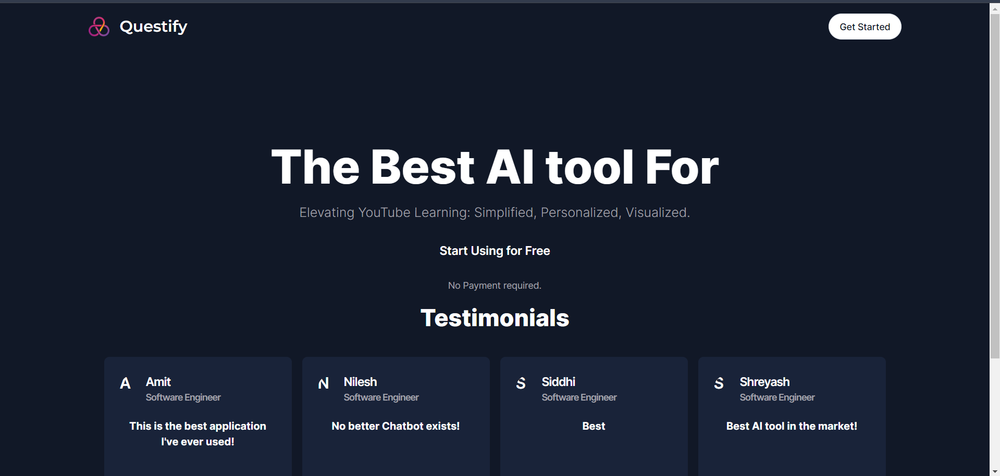
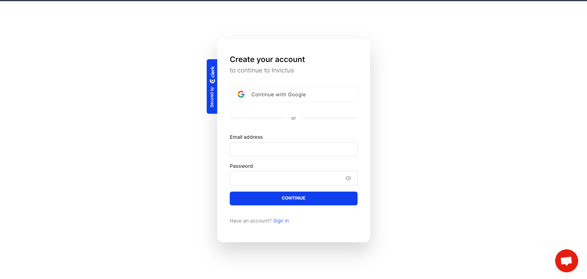
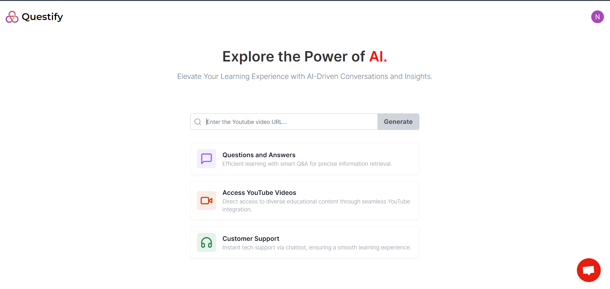
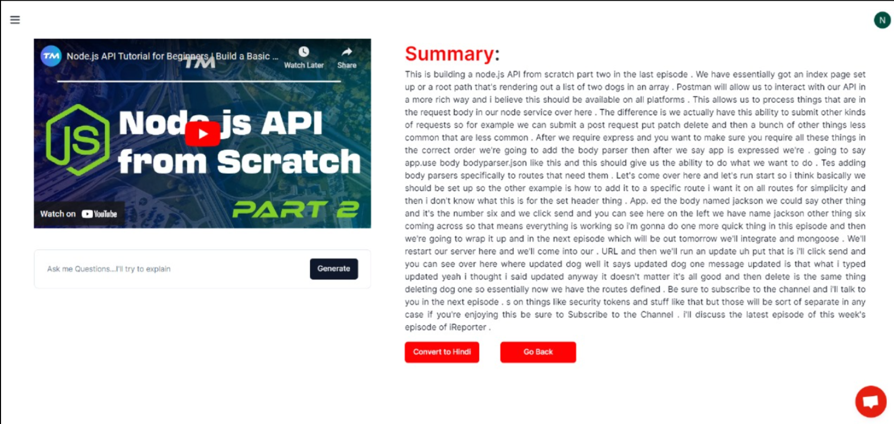
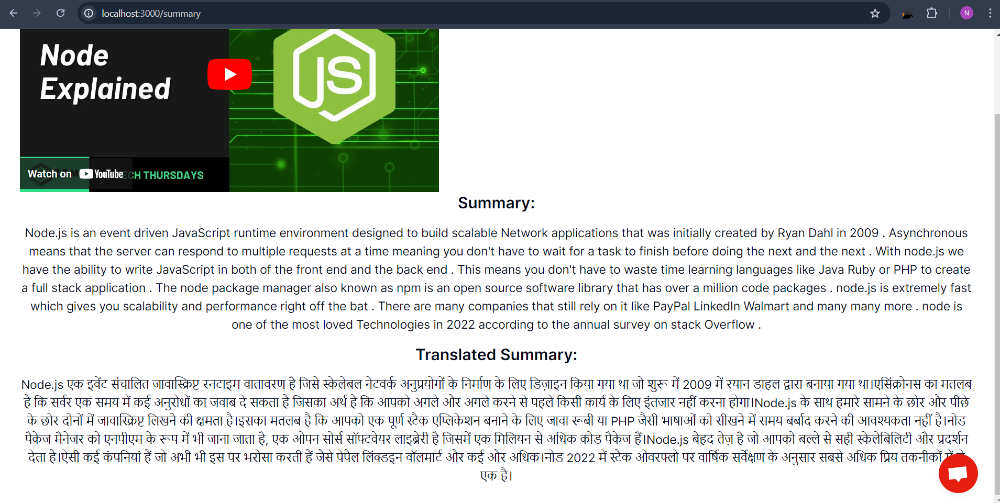
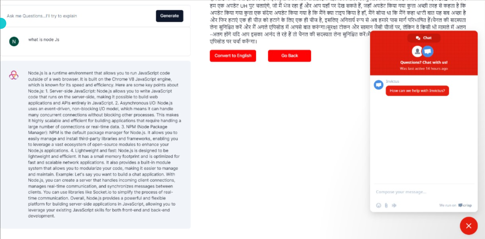

# Questify - YouTube Video Summarizer


## Overview

Questify is an AI-powered application designed to enhance your learning experience by summarizing YouTube videos, translating these summaries into multiple languages, and providing a voice-command query system. This platform aims to address the challenges faced by students with slow learning abilities, ensuring efficient retrieval of vital information and bridging accessibility gaps.



## Features

- **Comprehensive Video Exploration:** Integrates YouTube search, playback, summarization, multilingual translation.
- **Integrated Workflow:** Uses Next.js API routes and Flask to seamlessly integrate Hugging Face, Transformer, and Translator scripts.
- **Multilingual Summarization:** Summarizes YouTube videos, translates summaries into Hindi.
- **Interactive Chatbot:** Enhances user experience by providing instant answers based on video summaries.

## Tech Stack

- **Front-end:** Next.js, React, Tailwind CSS, TypeScript
- **Back-end:** Flask, Hugging Face Transformers, Google Translator API, OpenAI API, Crisp Provider
- **Database:** MongoDB
- **Other Tools:** Crisp SDK

## Project Pages

### ⭐ Landing Page
The main entry point for users, providing an overview of the platform's features and benefits.


### 🔑 Authentication Pages
Pages for user authentication including login, registration, and profile management.



### 📊 Main Dashboard
Dashboard explaining various features of the application.


### 📋 Video Input Page
Users can paste the URL of a YouTube video to generate summaries, translations, and audio outputs.




### 💬 Chatbot Interface
An interactive chatbot that provides instant answers based on video summaries.



## Key Highlights

- Developed an AI-powered platform for summarizing and translating YouTube videos.
- Created a chatbot interface for interactive learning.
- Leveraged Next.js and React with Tailwind CSS for an engaging front-end experience.
- Utilized Flask and Hugging Face Transformers for robust backend services.
- Integrated with Google Translator API and OpenAI API for advanced language processing and AI capabilities.
- Implemented Crisp SDK for customer support.


## Installation

1. Clone the repository
   ```bash
   git clone https://github.com/Nilesh270/Questify.git
   cd frontend
   ```

2. Install dependencies
   ```bash
   npm install
   ```

3. Set up the .env similar to envexample file


4. Run the development server
   ```bash
   npm run dev
   ```

5. Open http://localhost:3000 in your browser.


## Contribution

1. Fork the repository.
2. Create a new branch (git checkout -b feature/your-feature-name).
3. Make your changes and commit them (git commit -m 'Add some feature').
4. Push to the branch (git push origin feature/your-feature-name).
5. Create a new Pull Request.
